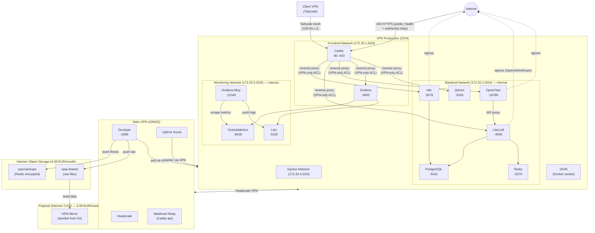
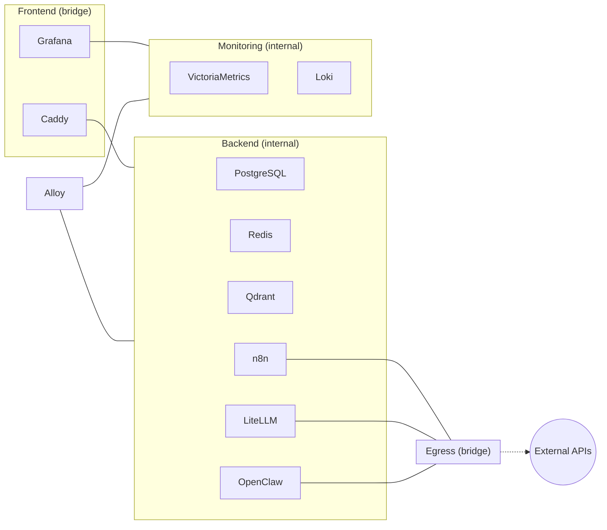
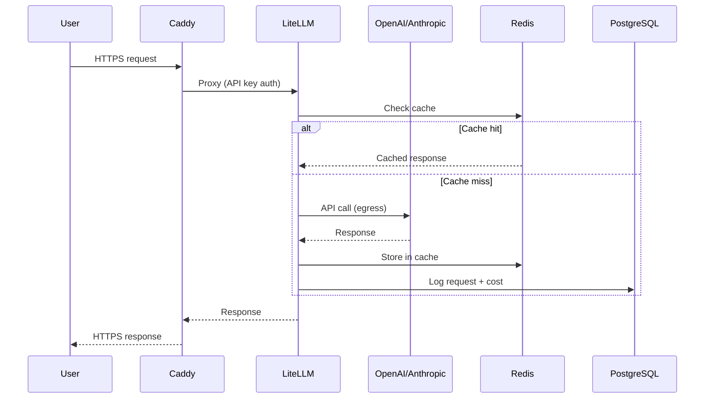
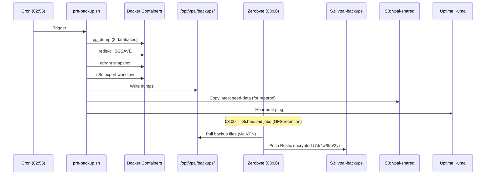
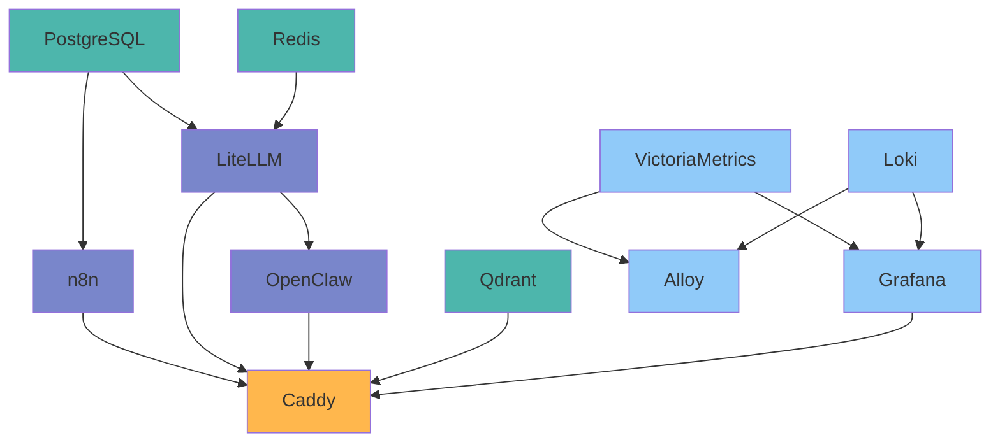

# ARCHITECTURE — System Diagrams

> **Project**: VPAI — Self-Hosted AI Infrastructure Stack

---

## 0. Infrastructure Réelle — État Opérationnel (2026-02-20)

### Serveurs

| Serveur | Provider | IP LAN / VPN | SSH | Rôle |
|---|---|---|---|---|
| **Sese-AI** | OVH VPS 8GB | 137.74.114.167 / 100.64.0.14 | port 804, user `mobuone` | Cerveau IA (Docker stack) |
| **Seko-VPN** | Ionos VPS | 87.106.30.160 | port 22, user `mobuone` | Hub VPN Headscale + monitoring externe |
| **Workstation Pi** | RPi5 16GB local | 192.168.1.8 / 100.64.0.1 | port 22, user `mobuone` | Mission Control + Dev |

**SSH Key** : `~/.ssh/seko-vpn-deploy` (Linux/WSL) ou `/c/Users/mmomb/.ssh/seko-vpn-deploy` (Git Bash Windows)

### DNS (domaine : `ewutelo.cloud`)

| Subdomain | IP | Cible | Accès |
|---|---|---|---|
| `javisi.ewutelo.cloud` | 100.64.0.14 | VPS Sese-AI (Tailscale) | VPN uniquement |
| `tala.ewutelo.cloud` | 100.64.0.14 | VPS Sese-AI (Tailscale) | VPN uniquement |
| `mayi.ewutelo.cloud` | 100.64.0.14 | VPS Sese-AI (Tailscale) | VPN uniquement |
| `llm.ewutelo.cloud` | 100.64.0.14 | VPS Sese-AI (Tailscale) | VPN uniquement |
| `qd.ewutelo.cloud` | 100.64.0.14 | VPS Sese-AI (Tailscale) | VPN uniquement |
| `mc.ewutelo.cloud` | 100.64.0.1 | Workstation Pi (Tailscale) | VPN uniquement |
| `oc.ewutelo.cloud` | 100.64.0.1 | Workstation Pi (Tailscale) | VPN uniquement |
| `singa.ewutelo.cloud` | 87.106.30.160 | Seko-VPN | Public (Headscale control plane) |

> Tous les records ci-dessus sont définis dans `extra_records` de la config Headscale sur Seko-VPN :
> `/opt/services/headscale/config/config.yaml`

### Headscale — Mesh VPN

```
Seko-VPN (87.106.30.160)
  └─ headscale/headscale:0.26.0 (Docker Compose)
       URL : https://singa.ewutelo.cloud
       Config : /opt/services/headscale/config/config.yaml
       Nodes :
         100.64.0.1  workstation-pi  (RPi5 Ubuntu)
         100.64.0.2  ewutelo         (PC Windows)
         100.64.0.14 sese            (VPS OVH Debian)
```

---

## 1. High-Level Architecture



## 1.5. Workstation Pi — Architecture Locale

```
Raspberry Pi 5 (16GB RAM, SSD 256Go, Ubuntu Server 24.04 LTS ARM64)
IP LAN : 192.168.1.8  |  IP Tailscale : 100.64.0.1

┌─────────────────────────────────────────────────────────────────┐
│                    Workstation Pi                               │
│                                                                 │
│  ┌──────────────────┐     ┌──────────────────┐                 │
│  │  Mission Control │     │    OpenCode       │                 │
│  │  (Next.js 14)    │     │  (v1.2.8 headless)│                 │
│  │  Port 4000       │     │  Port 3456        │                 │
│  │  v1.1.0          │     │  → LiteLLM API   │                 │
│  └────────┬─────────┘     └──────────────────┘                 │
│           │ WSS                                                 │
│           ▼                                                     │
│  ┌──────────────────┐     ┌──────────────────┐                 │
│  │     Caddy        │     │  Claude Code CLI │                 │
│  │  v2.10.2+OVH    │     │  v2.1.49         │                 │
│  │  :80 :443        │     │  OAuth Max Plan  │                 │
│  │  DNS-01 TLS      │     │  ~/.claude/      │                 │
│  └──────────────────┘     └──────────────────┘                 │
│                                                                 │
│  ┌──────────────────┐                                           │
│  │   Tailscale      │  ←──── Headscale (singa.ewutelo.cloud)   │
│  │  100.64.0.1      │                                           │
│  └──────────────────┘                                           │
└─────────────────────────────────────────────────────────────────┘
```

### Chemins importants sur le Pi

| Chemin | Contenu |
|---|---|
| `/opt/workstation/configs/caddy/Caddyfile` | Config Caddy (mc + oc reverse proxy) |
| `/opt/workstation/configs/opencode/opencode.json` | Config OpenCode (provider LiteLLM) |
| `/opt/workstation/mission-control/.env` | Config MC (OPENCLAW_GATEWAY_URL, etc.) |
| `/opt/workstation/data/mission-control/mission-control.db` | SQLite Mission Control |
| `/home/mobuone/.claude/` | Tokens OAuth Claude Code CLI |
| `/usr/bin/caddy` | Caddy buildé via xcaddy (avec OVH DNS module) |
| `/usr/bin/opencode` | OpenCode CLI (npm global NodeSource) |
| `/usr/bin/claude` | Claude Code CLI (npm global NodeSource) |
| `/usr/local/go/` | Go 1.24.2 (installé manuellement — Ubuntu 24.04 fournit 1.22) |
| `/root/go/bin/xcaddy` | xcaddy v0.4.5 |

### Services systemd sur le Pi

```bash
systemctl status caddy-workstation    # Caddy :80/:443 TLS OVH DNS-01
systemctl status mission-control       # Next.js :4000
systemctl status opencode              # OpenCode :3456 → LiteLLM
tailscale status                       # VPN mesh (sudo requis)
```

### Flux Mission Control ↔ OpenClaw

```
Browser (VPN) ──HTTPS──► mc.ewutelo.cloud ──► Caddy Pi :443
                                                    │
                                              reverse_proxy :4000
                                                    │
                                          Mission Control (Next.js)
                                                    │
                                    WSS wss://javisi.ewutelo.cloud
                                                    │
                          ◄──────── Tailscale mesh ─────────►
                                                    │
                                            OpenClaw (VPS)
                                                    │
                                              LiteLLM :4000
                                                    │
                                          Anthropic / OpenRouter
```

### Auth et Billing IA

| Outil | Auth | Billing |
|---|---|---|
| **Claude Code CLI** (`claude`) | OAuth Max Plan (`~/.claude/`) | Quota abonnement — gratuit |
| **OpenCode** | `LITELLM_API_KEY` env var | Via LiteLLM → budget $5/jour |
| **OpenClaw** | `openclaw_api_key` | Via LiteLLM → budget $5/jour |
| **n8n** | `litellm_master_key` | Via LiteLLM → budget $5/jour |

> **Claude Code OAuth** : auth manuelle une seule fois via `claude` en SSH (lien URL affiché dans le terminal,
> à ouvrir dans le navigateur). Tokens dans `~/.claude/`, auto-renouvelés. Ne PAS mettre `ANTHROPIC_API_KEY`
> dans l'environnement — ça court-circuiterait OAuth.

---

## 2. Network Segmentation



## 2.5 VPN Access Control — Split DNS

```
Client Windows (Tailscale connecté)
    │
    ├─ DNS query: mayi.ewutelo.cloud
    │   └─ DNS Tailscale (100.100.100.100) → extra_records Headscale
    │       └─ Répond: 100.64.0.14 (IP Tailscale du VPS)
    │
    └─ HTTPS → 100.64.0.14:443 → Docker DNAT → Caddy
        └─ client_ip = 172.20.1.1 (gateway bridge Docker, HTTP/3 QUIC/UDP)
        └─ 172.20.1.0/24 autorisé dans snippet vpn_only → Accès OK
```

Sans Split DNS (ou `override_local_dns: false`) :
```
Client → DNS public → 137.74.114.167 (IP publique VPS)
    └─ HTTPS → IP publique → Caddy
        └─ client_ip = IP publique client → NOT IN 100.64.0.0/10 → 403 Forbidden
```

## 3. Service Matrix

| Service | Frontend | Backend | Monitoring | Egress | Ports | Subdomain |
|---------|:--------:|:-------:|:----------:|:------:|-------|-----------|
| Caddy | X | X | | | 80, 443 | `domain` (root) |
| PostgreSQL | | X | | | 5432 | — (internal) |
| Redis | | X | | | 6379 | — (internal) |
| Qdrant | | X | | | 6333 | `qdrant_subdomain` |
| n8n | | X | | X | 5678 | `n8n_subdomain` |
| LiteLLM | | X | | X | 4000 | `litellm_subdomain` |
| OpenClaw | | X | | X | 18789 | `admin_subdomain` |
| VictoriaMetrics | | | X | | 8428 | — (internal) |
| Loki | | | X | | 3100 | — (internal) |
| Alloy | | X | X | | 12345 | — (internal) |
| Grafana | X | | X | | 3000 | `grafana_subdomain` |
| DIUN | | | | | — | — |

## 4. Data Flow



## 5. Backup & Data Tiering



### Data Temperature Tiers

| Tier | Location | Access | Content | Lifecycle |
|------|----------|--------|---------|-----------|
| **HOT** | VPS local NVMe | Daily, fast | Active databases, working files | Always |
| **WARM** | S3 Hetzner (4.99 EUR/month) | On-demand, API | Restic backups, seed data, recent docs | GFS retention |
| **COLD** | NAS TrueNAS (T+6 months) | Local/VPN, archive | Long-term archive, media library | Permanent |

### S3 Bucket Separation

| Bucket | Purpose | Format | Browsable |
|--------|---------|--------|:---------:|
| `vpai-backups` | Disaster recovery | Restic encrypted chunks | No |
| `vpai-shared` | Seed data, exports, documents | Raw files | Yes (Nextcloud) |

> Full details: `docs/BACKUP-STRATEGY.md`

## 6. Infrastructure Timeline

| Phase | Components Added | New Monthly Cost |
|-------|-----------------|-----------------|
| **T0 (Now)** | Preprod CX23, S3 Hetzner (2 buckets) | +8.48 EUR |
| **T+6 Weeks** | VPS Applicatif (Nextcloud, media) | +6-12 EUR |
| **T+6 Months** | NAS TrueNAS 10-12 TB (on-premises) | +5 EUR + 300 EUR one-time |

> Full details: `docs/BACKUP-STRATEGY.md` (section 8) and `docs/PREPROD-STRATEGY.md`

## 7. Startup Order



> **Note** : OpenClaw est un agent IA Gateway WebSocket (port 18789), file-based.
> Il ne depend PAS de PostgreSQL, Redis ou Qdrant. Il utilise LiteLLM comme proxy LLM.
