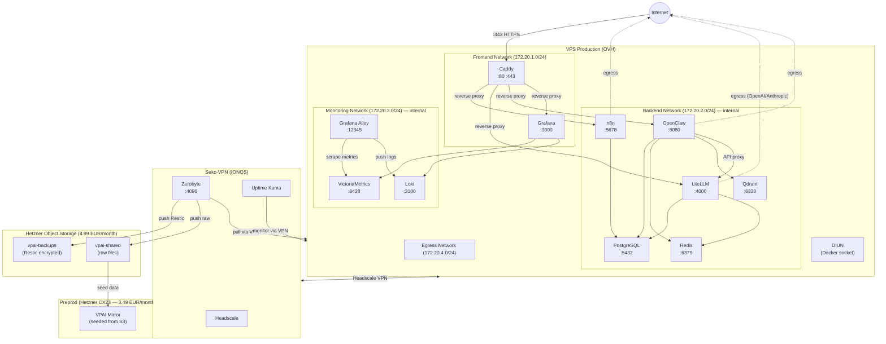
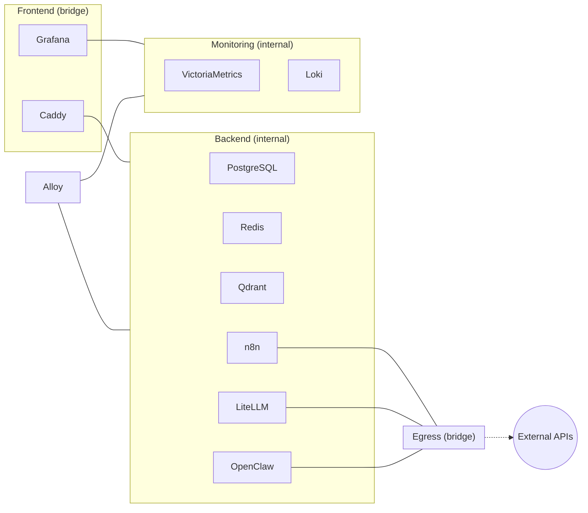
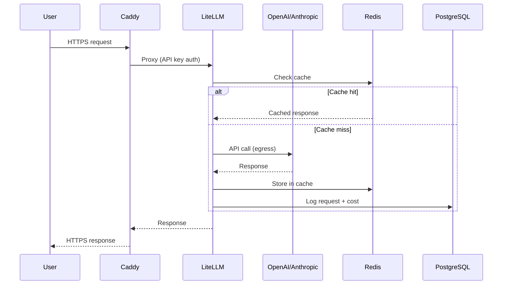
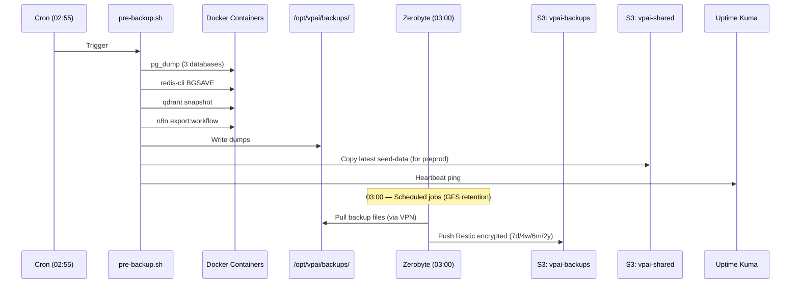
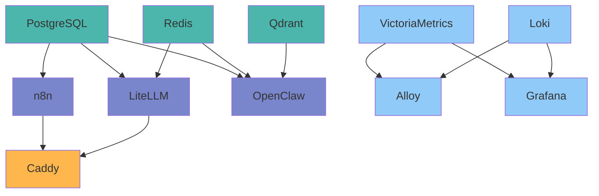

# ARCHITECTURE — System Diagrams

> **Project**: VPAI — Self-Hosted AI Infrastructure Stack

---

## 1. High-Level Architecture

## 2. Network Segmentation

## 3. Service Matrix

| Service | Frontend | Backend | Monitoring | Egress | Ports |
|---------|:--------:|:-------:|:----------:|:------:|-------|
| Caddy | X | X | | | 80, 443 |
| PostgreSQL | | X | | | 5432 |
| Redis | | X | | | 6379 |
| Qdrant | | X | | | 6333 |
| n8n | | X | | X | 5678 |
| LiteLLM | | X | | X | 4000 |
| OpenClaw | | X | | X | 8080 |
| VictoriaMetrics | | | X | | 8428 |
| Loki | | | X | | 3100 |
| Alloy | | X | X | | 12345 |
| Grafana | X | | X | | 3000 |
| DIUN | | | | | — |

## 4. Data Flow

## 5. Backup & Data Tiering

### Data Temperature Tiers

| Tier | Location | Access | Content | Lifecycle |
|------|----------|--------|---------|-----------|
| **HOT** | VPS local NVMe | Daily, fast | Active databases, working files | Always |
| **WARM** | S3 Hetzner (4.99 EUR/month) | On-demand, API | Restic backups, seed data, recent docs | GFS retention |
| **COLD** | NAS TrueNAS (T+6 months) | Local/VPN, archive | Long-term archive, media library | Permanent |

### S3 Bucket Separation

| Bucket | Purpose | Format | Browsable |
|--------|---------|--------|:---------:|
| `vpai-backups` | Disaster recovery | Restic encrypted chunks | No |
| `vpai-shared` | Seed data, exports, documents | Raw files | Yes (Nextcloud) |

> Full details: `docs/BACKUP-STRATEGY.md`

## 6. Infrastructure Timeline

| Phase | Components Added | New Monthly Cost |
|-------|-----------------|-----------------|
| **T0 (Now)** | Preprod CX23, S3 Hetzner (2 buckets) | +8.48 EUR |
| **T+6 Weeks** | VPS Applicatif (Nextcloud, media) | +6-12 EUR |
| **T+6 Months** | NAS TrueNAS 10-12 TB (on-premises) | +5 EUR + 300 EUR one-time |

> Full details: `docs/BACKUP-STRATEGY.md` (section 8) and `docs/PREPROD-STRATEGY.md`

## 7. Startup Order

