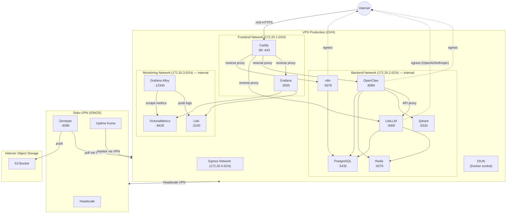
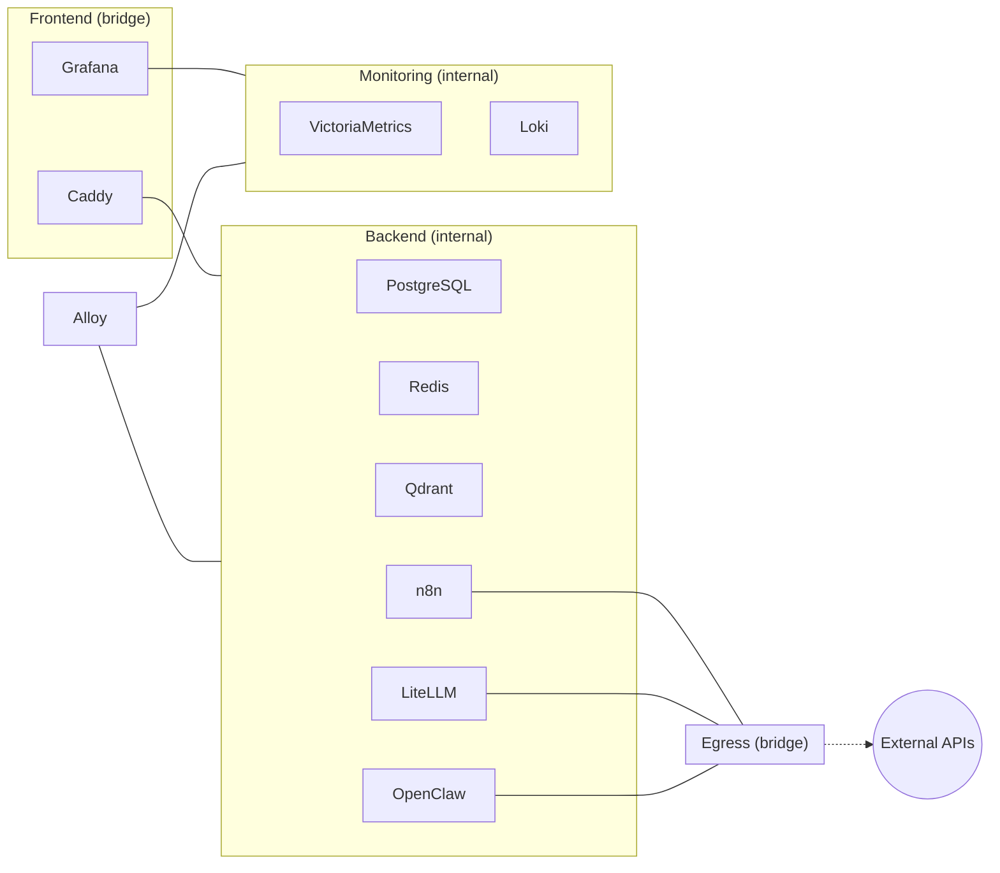
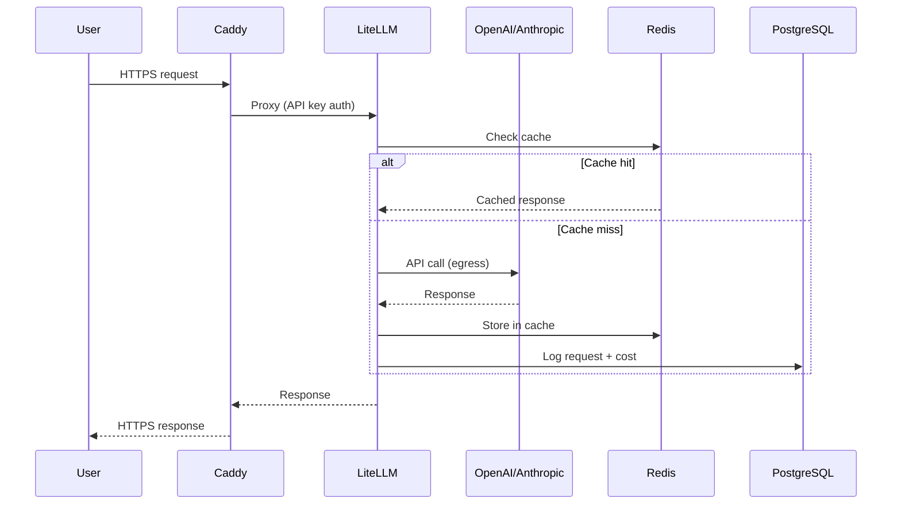
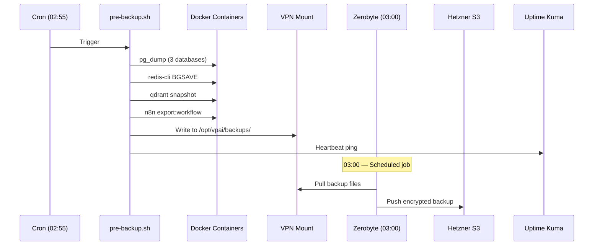
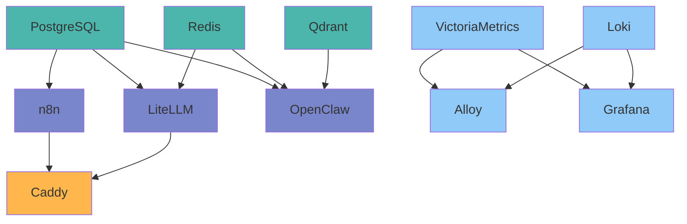

# ARCHITECTURE — System Diagrams

> **Project**: VPAI — Self-Hosted AI Infrastructure Stack

---

## 1. High-Level Architecture

## 2. Network Segmentation

## 3. Service Matrix

| Service | Frontend | Backend | Monitoring | Egress | Ports |
|---------|:--------:|:-------:|:----------:|:------:|-------|
| Caddy | X | X | | | 80, 443 |
| PostgreSQL | | X | | | 5432 |
| Redis | | X | | | 6379 |
| Qdrant | | X | | | 6333 |
| n8n | | X | | X | 5678 |
| LiteLLM | | X | | X | 4000 |
| OpenClaw | | X | | X | 8080 |
| VictoriaMetrics | | | X | | 8428 |
| Loki | | | X | | 3100 |
| Alloy | | X | X | | 12345 |
| Grafana | X | | X | | 3000 |
| DIUN | | | | | — |

## 4. Data Flow

## 5. Backup Flow

## 6. Startup Order

