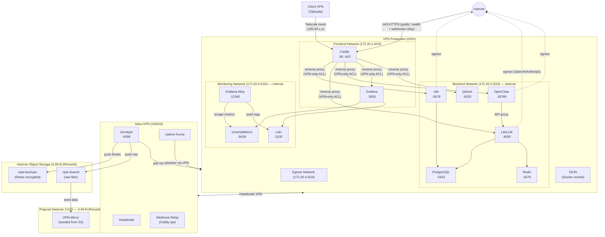
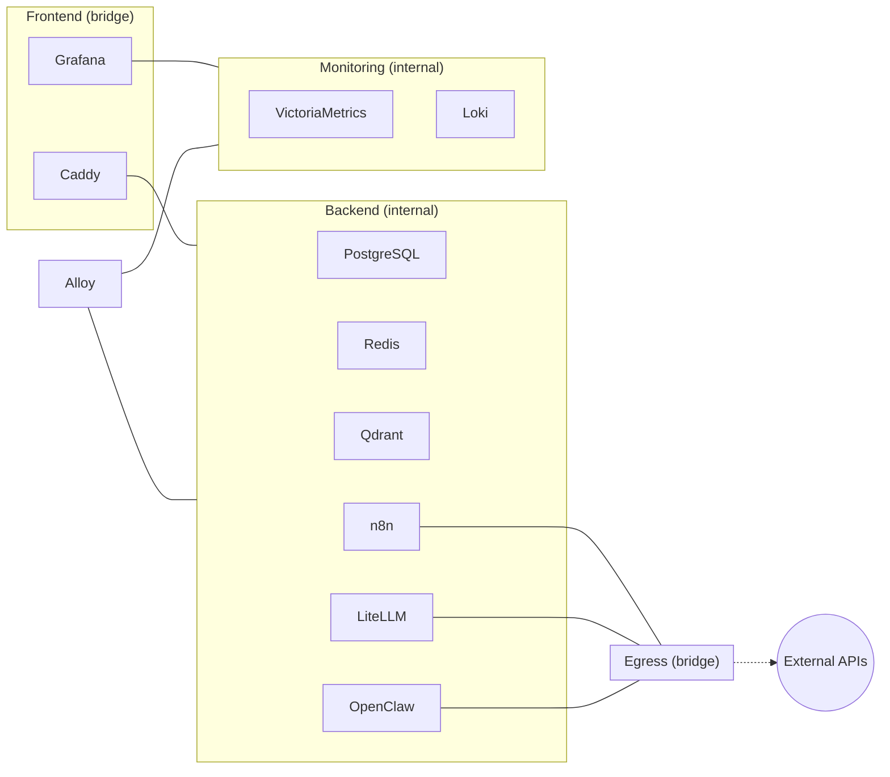
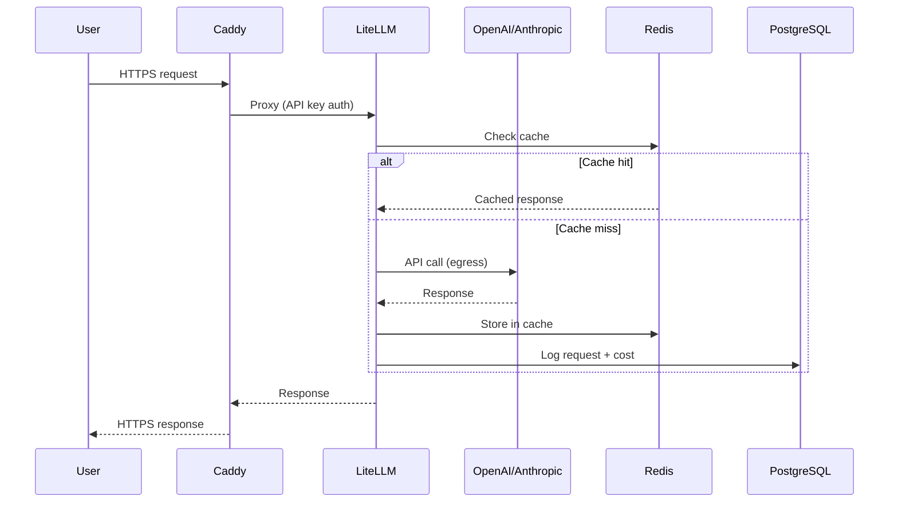
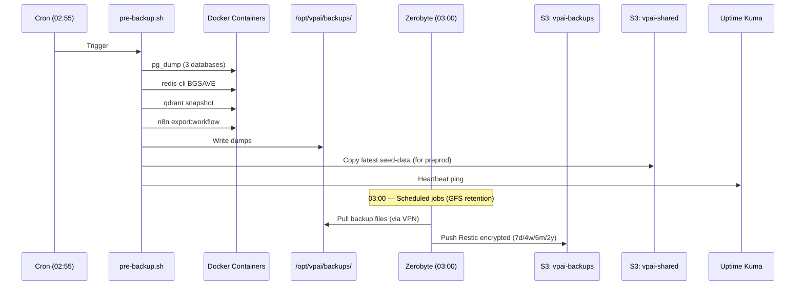
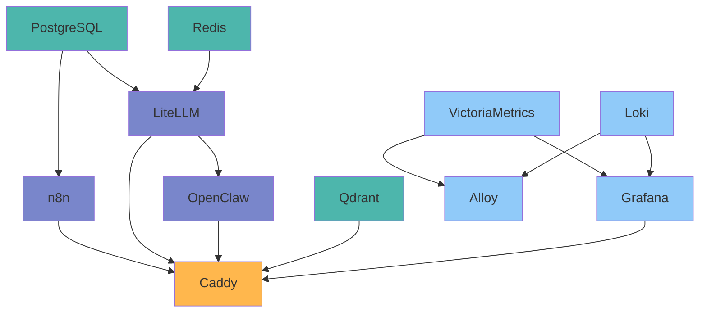

# ARCHITECTURE — System Diagrams

> **Project**: VPAI — Self-Hosted AI Infrastructure Stack

---

## 0. Infrastructure Réelle — État Opérationnel (2026-02-20)

### Serveurs

| Serveur | Provider | IP LAN / VPN | SSH | Rôle |
|---|---|---|---|---|
| **Sese-AI** | OVH VPS 8GB | 137.74.114.167 / 100.64.0.14 | port 804, user `mobuone` | Cerveau IA (Docker stack) |
| **Seko-VPN** | Ionos VPS | 87.106.30.160 | port 22, user `mobuone` | Hub VPN Headscale + monitoring externe |
| **Workstation Pi** | RPi5 16GB local | 192.168.1.8 / 100.64.0.1 | port 22, user `mobuone` | AI Creative Studio (ComfyUI, Remotion) + Dev |

**SSH Key** : `~/.ssh/seko-vpn-deploy` (Linux/WSL) ou `/c/Users/mmomb/.ssh/seko-vpn-deploy` (Git Bash Windows)

### DNS (domaine : `ewutelo.cloud`)

| Subdomain | IP | Cible | Accès |
|---|---|---|---|
| `javisi.ewutelo.cloud` | 100.64.0.14 | VPS Sese-AI (Tailscale) | VPN uniquement |
| `tala.ewutelo.cloud` | 100.64.0.14 | VPS Sese-AI (Tailscale) | VPN uniquement |
| `mayi.ewutelo.cloud` | 100.64.0.14 | VPS Sese-AI (Tailscale) | VPN uniquement |
| `llm.ewutelo.cloud` | 100.64.0.14 | VPS Sese-AI (Tailscale) | VPN uniquement |
| `qd.ewutelo.cloud` | 100.64.0.14 | VPS Sese-AI (Tailscale) | VPN uniquement |
| `studio.ewutelo.cloud` | 100.64.0.1 | Workstation Pi (Tailscale) → ComfyUI :8188 | VPN uniquement |
| `cut.ewutelo.cloud` | 100.64.0.1 | Workstation Pi (Tailscale) → Remotion :3200 | VPN uniquement |
| `oc.ewutelo.cloud` | 100.64.0.1 | Workstation Pi (Tailscale) → OpenCode :3456 | VPN uniquement |
| `hq.ewutelo.cloud` | 100.64.0.14 | VPS Sese-AI (Tailscale) → Kaneo :3000 | VPN uniquement |
| `couch.ewutelo.cloud` | 137.74.114.167 | Sese-AI Caddy → Seko-VPN:5984 (Tailscale) | **Public** (auth CouchDB) |
| `singa.ewutelo.cloud` | 87.106.30.160 | Seko-VPN | Public (Headscale control plane) |

> Tous les records ci-dessus sont définis dans `extra_records` de la config Headscale sur Seko-VPN :
> `/opt/services/headscale/config/config.yaml`

### Headscale — Mesh VPN

```
Seko-VPN (87.106.30.160)
  └─ headscale/headscale:0.26.0 (Docker Compose)
       URL : https://singa.ewutelo.cloud
       Config : /opt/services/headscale/config/config.yaml
       Nodes :
         100.64.0.1  workstation-pi  (RPi5 Ubuntu)
         100.64.0.2  ewutelo         (PC Windows)
         100.64.0.14 sese            (VPS OVH Debian)
```

---

## 1. High-Level Architecture



## 1.5. Workstation Pi — Architecture Locale

```
Raspberry Pi 5 (16GB RAM, SSD 256Go, Ubuntu Server 24.04 LTS ARM64)
IP LAN : 192.168.1.8  |  IP Tailscale : 100.64.0.1

┌──────────────────────────────────────────────────────────────────────┐
│                         Workstation Pi                               │
│                                                                      │
│  ┌──────────────────────┐     ┌──────────────────────┐              │
│  │  ComfyUI v0.3.27     │     │  Remotion v4.0.259   │              │
│  │  (Docker, ARM64 CPU) │     │  (Docker + Chrome)   │              │
│  │  Port 8188           │     │  Port 3200           │              │
│  │  Image gen (stable   │     │  Video rendering     │              │
│  │  diffusion, etc.)    │     │  (MP4 via HTTP API)  │              │
│  └──────────────────────┘     └──────────────────────┘              │
│           │  studio.ewutelo.cloud    │  cut.ewutelo.cloud            │
│           └──────────┬──────────────┘                               │
│                      ▼                                               │
│  ┌──────────────────────┐     ┌──────────────────────┐              │
│  │        Caddy         │     │   Claude Code CLI    │              │
│  │  v2.10.2 + OVH DNS   │     │   OAuth Max Plan     │              │
│  │  :80 :443            │     │   ~/.claude/         │              │
│  │  DNS-01 TLS auto     │     │                      │              │
│  └──────────────────────┘     └──────────────────────┘              │
│                                                                      │
│  ┌──────────────────────┐     ┌──────────────────────┐              │
│  │   OpenCode CLI       │     │     Tailscale        │              │
│  │  Port 3456           │     │  100.64.0.1          │              │
│  │  → LiteLLM API (VPS) │     │  ← Headscale VPN     │              │
│  └──────────────────────┘     └──────────────────────┘              │
│                                                                      │
│  Réseau Docker : workstation_creative (bridge)                       │
│  Volumes partagés : /opt/workstation/data/creative-assets            │
└──────────────────────────────────────────────────────────────────────┘
```

### Flux Creative Studio — Image Generation

```
Browser (VPN) ──HTTPS──► studio.ewutelo.cloud ──► Caddy Pi :443
                                                        │
                                                  reverse_proxy :8188
                                                        │
                                             ComfyUI (Docker ARM64)
                                                        │
                                         /opt/workstation/data/comfyui/
                                              models/ output/ input/

n8n (VPS) ──HTTPS──► studio.ewutelo.cloud ──► ComfyUI /prompt
                          (via creative-pipeline workflow)
```

### Flux Creative Studio — Video Rendering

```
Browser (VPN) ──HTTPS──► cut.ewutelo.cloud ──► Caddy Pi :443
                                                     │
                                               reverse_proxy :3200
                                                     │
                                          Remotion (Docker + Chrome)
                                                     │
                                      /opt/workstation/data/remotion/output/

n8n (VPS) ──HTTPS──► cut.ewutelo.cloud ──► Remotion /render
                         (via creative-pipeline workflow)
```

### Flux n8n Creative Pipeline (cross-host VPS → Pi)

```
n8n (VPS, backend network) ──HTTPS (Tailscale mesh)──►
    studio.ewutelo.cloud → ComfyUI (image)
    cut.ewutelo.cloud    → Remotion (video)
         │
         ▼
    asset-register workflow → PostgreSQL (provenance)
    → Kaneo (hq.ewutelo.cloud) — task tracking
```

### Chemins importants sur le Pi

| Chemin | Contenu |
|---|---|
| `/opt/workstation/configs/caddy/Caddyfile` | Config Caddy (studio + cut + oc reverse proxies) |
| `/opt/workstation/configs/opencode/opencode.json` | Config OpenCode (provider LiteLLM) |
| `/opt/workstation/comfyui/docker-compose-creative.yml` | Docker Compose ComfyUI + Remotion |
| `/opt/workstation/data/comfyui/` | Models, output, input, custom_nodes |
| `/opt/workstation/data/remotion/output/` | Vidéos rendues |
| `/opt/workstation/data/creative-assets/` | Assets partagés ComfyUI ↔ Remotion |
| `/home/mobuone/.claude/` | Tokens OAuth Claude Code CLI |
| `/usr/bin/caddy` | Caddy buildé via xcaddy (avec OVH DNS module) |
| `/usr/bin/opencode` | OpenCode CLI (npm global NodeSource) |
| `/usr/bin/claude` | Claude Code CLI (npm global NodeSource) |
| `/usr/local/go/` | Go 1.24.2 (installé manuellement — Ubuntu 24.04 fournit 1.22) |
| `/root/go/bin/xcaddy` | xcaddy v0.4.5 |

### Services sur le Pi

```bash
systemctl status caddy-workstation    # Caddy :80/:443 TLS OVH DNS-01
systemctl status tailscaled           # VPN Tailscale (auto-start au boot)
tailscale status                      # État VPN mesh (sudo requis)

# AI Creative Studio (Docker)
docker ps --filter name=workstation_  # comfyui + remotion containers
docker logs workstation_comfyui       # Logs ComfyUI
docker logs workstation_remotion      # Logs Remotion
```

### Auth et Billing IA

| Outil | Auth | Billing |
|---|---|---|
| **Claude Code CLI** (`claude`) | OAuth Max Plan (`~/.claude/`) | Quota abonnement — gratuit |
| **OpenCode** | `LITELLM_API_KEY` env var | Via LiteLLM → budget $5/jour |
| **OpenClaw** | `openclaw_api_key` | Via LiteLLM → budget $5/jour |
| **n8n** | `litellm_master_key` | Via LiteLLM → budget $5/jour |
| **ComfyUI** | Aucune (VPN-only) | CPU local — gratuit |
| **Remotion** | `REMOTION_API_TOKEN` (optionnel) | CPU local — gratuit |

> **Claude Code OAuth** : auth manuelle une seule fois via `claude` en SSH (lien URL affiché dans le terminal,
> à ouvrir dans le navigateur). Tokens dans `~/.claude/`, auto-renouvelés. Ne PAS mettre `ANTHROPIC_API_KEY`
> dans l'environnement — ça court-circuiterait OAuth.

---

## 2. Network Segmentation



## 2.5 VPN Access Control — Split DNS

```
Client Windows (Tailscale connecté)
    │
    ├─ DNS query: mayi.ewutelo.cloud
    │   └─ DNS Tailscale (100.100.100.100) → extra_records Headscale
    │       └─ Répond: 100.64.0.14 (IP Tailscale du VPS)
    │
    └─ HTTPS → 100.64.0.14:443 → Docker DNAT → Caddy
        └─ client_ip = 172.20.1.1 (gateway bridge Docker, HTTP/3 QUIC/UDP)
        └─ 172.20.1.0/24 autorisé dans snippet vpn_only → Accès OK
```

Sans Split DNS (ou `override_local_dns: false`) :
```
Client → DNS public → 137.74.114.167 (IP publique VPS)
    └─ HTTPS → IP publique → Caddy
        └─ client_ip = IP publique client → NOT IN 100.64.0.0/10 → 403 Forbidden
```

## 3. Service Matrix

### VPS Sese-AI (OVH)

| Service | Frontend | Backend | Monitoring | Egress | Ports | Subdomain |
|---------|:--------:|:-------:|:----------:|:------:|-------|-----------|
| Caddy | X | X | | | 80, 443 | `domain` (root) |
| PostgreSQL | | X | | | 5432 | — (internal) |
| Redis | | X | | | 6379 | — (internal) |
| Qdrant | | X | | | 6333 | `qdrant_subdomain` |
| n8n | | X | | X | 5678 | `n8n_subdomain` |
| LiteLLM | | X | | X | 4000 | `litellm_subdomain` |
| OpenClaw | | X | | X | 18789 | `admin_subdomain` |
| Kaneo | | X | | | 1337 (API), 3000 (web) | `kaneo_subdomain` (hq) |
| VictoriaMetrics | | | X | | 8428 | — (internal) |
| Loki | | | X | | 3100 | — (internal) |
| Alloy | | X | X | | 12345 | — (internal) |
| Grafana | X | | X | | 3000 | `grafana_subdomain` |
| DIUN | | | | | — | — |

### Workstation Pi (RPi5)

| Service | Réseau | Ports | Subdomain | Notes |
|---------|--------|-------|-----------|-------|
| Caddy workstation | host | 80, 443 | — | TLS DNS-01 OVH, reverse proxy |
| ComfyUI | workstation_creative | 8188 | `comfyui_subdomain` (studio) | ARM64 CPU-only, Docker |
| Remotion | workstation_creative | 3200 | `remotion_subdomain` (cut) | Chrome headless, Docker |
| OpenCode CLI | — | 3456 | `oc_subdomain` (oc) | npm global |
| Claude Code CLI | — | — | — | OAuth Max Plan |
| Tailscale | — | — | — | VPN mesh, systemd auto-start |

## 4. Data Flow



## 5. Backup & Data Tiering



### Data Temperature Tiers

| Tier | Location | Access | Content | Lifecycle |
|------|----------|--------|---------|-----------|
| **HOT** | VPS local NVMe | Daily, fast | Active databases, working files | Always |
| **WARM** | S3 Hetzner (4.99 EUR/month) | On-demand, API | Restic backups, seed data, recent docs | GFS retention |
| **COLD** | NAS TrueNAS (T+6 months) | Local/VPN, archive | Long-term archive, media library | Permanent |

### S3 Bucket Separation

| Bucket | Purpose | Format | Browsable |
|--------|---------|--------|:---------:|
| `vpai-backups` | Disaster recovery | Restic encrypted chunks | No |
| `vpai-shared` | Seed data, exports, documents | Raw files | Yes (Nextcloud) |

> Full details: `docs/BACKUP-STRATEGY.md`

## 6. Infrastructure Timeline

| Phase | Components Added | New Monthly Cost |
|-------|-----------------|-----------------|
| **T0 (Now)** | Preprod CX23, S3 Hetzner (2 buckets) | +8.48 EUR |
| **T+6 Weeks** | VPS Applicatif (Nextcloud, media) | +6-12 EUR |
| **T+6 Months** | NAS TrueNAS 10-12 TB (on-premises) | +5 EUR + 300 EUR one-time |

> Full details: `docs/BACKUP-STRATEGY.md` (section 8) and `docs/PREPROD-STRATEGY.md`

## 7. Startup Order



> **Note** : OpenClaw est un agent IA Gateway WebSocket (port 18789), file-based.
> Il ne depend PAS de PostgreSQL, Redis ou Qdrant. Il utilise LiteLLM comme proxy LLM.

---

## 8. État Opérationnel — 2026-02-26

> Section générée en session 10 — mis à jour à chaque session

### 8.1 Inventaire Complet par Serveur

#### Sese-AI — OVH VPS 8GB (prod)

| Catégorie | Service | Version | Port | Accès |
|---|---|---|---|---|
| **Reverse Proxy** | Caddy | xcaddy custom | 80/443 | Public |
| **Workflow** | n8n | 2.7.3 | 5678 | VPN only |
| **LLM Proxy** | LiteLLM | v1.81.3 | 4000 | VPN + API key |
| **Agent IA** | OpenClaw | v2026.2.22 | 8080 | VPN only |
| **Dashboard** | Palais | custom | 3300 | VPN only |
| **Finance** | Sure (Maybe fork) | — | 3000 | VPN only (`nzimbu`) |
| **Base de données** | PostgreSQL | 18.1 | 5432 | interne |
| **Cache** | Redis | 8.0 | 6379 | interne |
| **Vector DB** | Qdrant | v1.16.3 | 6333 | interne |
| **Métriques** | VictoriaMetrics | v1.135.0 | 8428 | interne |
| **Logs** | Loki | 3.6.5 | 3100 | interne |
| **Collecteur** | Grafana Alloy | v1.13.0 | — | interne |
| **Dashboards** | Grafana | 12.3.2 | 3000 | VPN only |
| **Container stats** | cAdvisor | v0.55.1 | — | interne |
| **Image updates** | DIUN | 4.31.0 | — | système |
| **Firewall** | UFW + Fail2ban + CrowdSec | — | — | système |

#### Workstation — Raspberry Pi 5 16GB (local LAN / VPN)

| Catégorie | Service | Version | Port | Accès |
|---|---|---|---|---|
| **Reverse Proxy** | Caddy Workstation | xcaddy + OVH DNS-01 | 80/443 | VPN only |
| **Génération image** | ComfyUI | v0.3.27 ARM64 | 8188 | VPN → `studio.*` |
| **Rendu vidéo** | Remotion API | v4.0.259 | 3200 | VPN → `re.*` |
| **Éditeur vidéo** | OpenCut (Next.js) | on-demand | 3456 | VPN → `cut.*` |
| **OpenCut DB** | PostgreSQL (dédié) | — | 5432 | interne Pi |
| **OpenCut Cache** | Valkey + serverless-redis-http | — | — | interne Pi |
| **Code assistant** | OpenCode | — | — | local CLI |
| **Code assistant** | Claude Code CLI | — | — | local CLI |
| **VPN** | Tailscale node | — | — | mesh VPN |
| **Monitoring** | workstation-monitoring | — | — | → Sese-AI |

#### Seko-VPN — Ionos (hub VPN)

| Service | Version | Port | Rôle |
|---|---|---|---|
| Headscale | — | — | Serveur coordination VPN mesh |
| Zerobyte | v0.16 | — | Orchestrateur backups (pull VPN → S3) |
| Uptime Kuma | — | — | Monitoring uptime externes |
| webhook-relay | — | — | Relay webhooks entrants |
| **CouchDB** | **3.3.3** | **5984** | **Backend sync Obsidian LiveSync** |

### 8.2 Schéma ASCII — Vue Globale

```
╔══════════════════════════════════════════════════════════════════════════════════╗
║                         INTERNET / CLIENTS                                       ║
║   Browser VPN  ·  Telegram  ·  OpenRouter  ·  Anthropic  ·  OpenAI  ·  BytePlus ║
╚══════╤═════════════════════════════╤════════════════════════════════════════════╝
       │ HTTPS :443 (public)         │ VPN Tailscale mesh (100.64.0.0/10)
       │                             │
╔══════▼═════════════════════════════▼══════════════════════════════════════════╗
║  SEKO-VPN — Ionos (Hub VPN)                                                   ║
║  ┌─────────────────┐  ┌───────────────────────┐  ┌──────────────────────┐    ║
║  │   Headscale     │  │   Zerobyte v0.16       │  │   Uptime Kuma        │    ║
║  │ (coord. mesh)   │  │ (backup orchestrator)  │  │ (monitoring uptime)  │    ║
║  └────────┬────────┘  └───────────┬───────────┘  └──────────────────────┘    ║
║           │ split DNS             │ VPN pull                                   ║
║  ┌────────▼──────────┐    ┌───────▼─────────────┐  ┌──────────────────────┐  ║
║  │  extra_records    │    │  webhook-relay       │  │  CouchDB 3.3.3       │  ║
║  │  (DNS VPN local)  │    │  (webhooks entrants) │  │  :5984 (Docker)      │  ║
║  └───────────────────┘    └─────────────────────┘  │  Obsidian LiveSync   │  ║
║                                                     │  public HTTPS (auth) │  ║
║                                                     └──────────────────────┘  ║
╚═══════════════════════════════════════════════════════════════════════════════╝
           │ Tailscale mesh                    │ S3 API
           │                        ╔══════════▼═══════════════╗
           │                        ║  Hetzner S3              ║
           │                        ║  vpai-backups (Restic)   ║
           │                        ║  GFS: 7j/4s/6m/2a        ║
           │                        ╚══════════════════════════╝
           │
╔══════════▼════════════════════════════════════════════════════════════════════╗
║  SESE-AI — OVH VPS 8GB   (prod)                                                ║
║                                                                                ║
║  ┌──────────────────────────────────────────────────────────────────────────┐ ║
║  │  CADDY  :80/:443  (TLS auto, ACL VPN)                                    │ ║
║  │  Public: /health, /litellm/*                                              │ ║
║  │  VPN-only: n8n, grafana, openclaw, qdrant, palais, sure, litellm-ui      │ ║
║  └────────────────────────────────┬─────────────────────────────────────────┘ ║
║              network: frontend (172.20.1.0/24)                                 ║
║  ┌───────────────────────────────────────────────────────────────────────────┐ ║
║  │  APPLICATIONS   network: backend (172.20.2.0/24, internal)                │ ║
║  │                                                                            │ ║
║  │  ┌──────────────┐  ┌──────────────┐  ┌────────────────┐  ┌─────────────┐ │ ║
║  │  │     n8n      │  │   LiteLLM    │  │   OpenClaw     │  │   Palais    │ │ ║
║  │  │   v2.7.3     │  │  v1.81.3     │  │  v2026.2.22    │  │  (custom)   │ │ ║
║  │  │  :5678       │  │  :4000       │  │  :8080         │  │  :3300      │ │ ║
║  │  │ Workflows    │  │ LLM Proxy    │  │ Agent IA       │  │ Dashboard   │ │ ║
║  │  │ Automation   │  │ OpenRouter   │  │ Bot Telegram   │  │ Topology    │ │ ║
║  │  │ Creative     │  │ Anthropic    │  │ 10 agents      │  │ VPN / Ops   │ │ ║
║  │  │ Pipeline     │  │ OpenAI       │  │ @WazaBangaBot  │  │ Standup 8h  │ │ ║
║  │  └──────┬───────┘  └──────┬───────┘  └───────┬────────┘  └─────────────┘ │ ║
║  │         │                 │                   │                            │ ║
║  │  ┌──────▼─────────────────▼───────────────────▼──────────────────────┐   │ ║
║  │  │  Sure (Maybe Finance fork) :3000                                   │   │ ║
║  │  └───────────────────────────────────────────────────────────────────┘   │ ║
║  └───────────────────────────────────────────────────────────────────────────┘ ║
║                                                                                ║
║  ┌───────────────────────────────────────────────────────────────────────────┐ ║
║  │  DONNÉES    network: backend (172.20.2.0/24, internal)                    │ ║
║  │  ┌───────────────┐  ┌───────────┐  ┌─────────────────────────────────┐   │ ║
║  │  │  PostgreSQL   │  │   Redis   │  │           Qdrant                │   │ ║
║  │  │    18.1       │  │    8.0    │  │          v1.16.3                │   │ ║
║  │  │  n8n | sure   │  │  cache    │  │        Vector DB                │   │ ║
║  │  │  litellm      │  │  litellm  │  │     (mémoire agents)            │   │ ║
║  │  │  palais       │  │  sessions │  └─────────────────────────────────┘   │ ║
║  │  └───────────────┘  └───────────┘                                        │ ║
║  └───────────────────────────────────────────────────────────────────────────┘ ║
║                                                                                ║
║  ┌───────────────────────────────────────────────────────────────────────────┐ ║
║  │  OBSERVABILITÉ   network: monitoring (172.20.3.0/24, internal)            │ ║
║  │  ┌────────────────┐  ┌──────────────────┐  ┌──────────┐  ┌────────────┐  │ ║
║  │  │    Grafana     │  │  VictoriaMetrics  │  │   Loki   │  │   Alloy   │  │ ║
║  │  │   12.3.2       │  │   v1.135.0        │  │  3.6.5   │  │  v1.13.0  │  │ ║
║  │  └────────────────┘  └──────────────────┘  └──────────┘  └────────────┘  │ ║
║  │  + DIUN 4.31.0 (image update notifier)                                    │ ║
║  └───────────────────────────────────────────────────────────────────────────┘ ║
║  ┌───────────────────────────────────────────────────────────────────────────┐ ║
║  │  SÉCURITÉ : UFW · Fail2ban · CrowdSec                                     │ ║
║  └───────────────────────────────────────────────────────────────────────────┘ ║
╚════════════════════════════════════════════════════════════════════════════════╝
           │ Tailscale VPN
╔══════════▼════════════════════════════════════════════════════════════════════╗
║  WORKSTATION — Raspberry Pi 5 16GB (local LAN / VPN)                          ║
║                                                                                ║
║  ┌──────────────────────────────────────────────────────────────────────────┐ ║
║  │  CADDY Workstation  (xcaddy + OVH DNS-01 TLS, VPN ACL 100.64.0.0/10)   │ ║
║  │  studio.*→ComfyUI  ·  re.*→Remotion  ·  cut.*→OpenCut (on-demand)       │ ║
║  └──────────────┬────────────────────────┬──────────────────────────────────┘ ║
║                 │                        │                                     ║
║  ┌──────────────▼──────┐  ┌─────────────▼──────────┐  ┌─────────────────────┐║
║  │     ComfyUI         │  │    Remotion API         │  │  OpenCut (on-demand)║║
║  │   v0.3.27 ARM64     │  │    v4.0.259             │  │  Next.js :3456      ║║
║  │   Génération image  │  │    Rendu vidéo           │  │  + PG + Valkey      ║║
║  │   4096M / 3.0 CPU   │  │    512M / 2.0 CPU       │  │  /opencut start|stop║║
║  └─────────────────────┘  └─────────────────────────┘  └─────────────────────┘║
║                                                                                ║
║  CLI (host) : OpenCode  ·  Claude Code CLI                                     ║
║  workstation-monitoring → VictoriaMetrics Sese-AI                              ║
╚════════════════════════════════════════════════════════════════════════════════╝
```

### 8.3 Réseaux Docker (Sese-AI)

| Réseau | Subnet | Internal | Services principaux |
|---|---|---|---|
| `frontend` | 172.20.1.0/24 | Non | Caddy, Grafana |
| `backend` | 172.20.2.0/24 | Oui | PG, Redis, Qdrant, n8n, LiteLLM, OpenClaw, Caddy, Alloy, Grafana |
| `monitoring` | 172.20.3.0/24 | Oui | VictoriaMetrics, Loki, Alloy, Grafana, cAdvisor |
| `egress` | 172.20.4.0/24 | Non | n8n, LiteLLM, OpenClaw (sortie internet) |
| `sandbox` | 172.20.5.0/24 | Oui | OpenClaw sous-agents isolés |

### 8.4 Budget IA

| Provider | Part | Modèles utilisés |
|---|---|---|
| OpenRouter | 65% | deepseek-v3:free, qwen3-coder:free, deepseek-r1:free… |
| Anthropic | 15% | Claude Sonnet, Haiku |
| OpenAI | 10% | GPT-4o |
| zAI | 5% | Réserve |

- **Budget global** : $5/jour (hard cap LiteLLM `max_budget`)
- **BytePlus/Seedance** : $5/mois séparé (vidéo cloud, via n8n creative pipeline)
- **Éco mode** : auto à 100% — `qwen3-coder:free` + `deepseek-v3:free` toujours actifs
- **Contrôle Telegram** : `/budget`, `/budget eco on`, `/budget eco off`

### 8.5 Obsidian Vault Sync (CouchDB + LiveSync)

**Architecture** : CouchDB sur Seko-VPN ← Sese-AI Caddy proxy → obsidian-livesync (iOS + PC)

```
iPhone 13 (iOS)                    PC Windows (VPN)
  Obsidian App                       Obsidian App
  livesync plugin                    livesync plugin
       │ HTTPS :443                       │ HTTPS (VPN)
       ▼                                  ▼
couch.ewutelo.cloud ◄──── Caddy (Sese-AI) ────►
(Public — auth CouchDB)    reverse_proxy
                           vpn_tailscale_ip:5984
                                  │ Tailscale mesh
                                  ▼
                     Seko-VPN — CouchDB 3.3.3 :5984
                     /opt/vpn/data/couchdb/
                     DB: obsidian_vault
                     User: obsidian (lecture/écriture vault)
                          │
                     cron 02:00 (nightly)
                          │
                     dump-vault.py → /opt/vpn/data/obsidian-vault/
                          │
                     git commit → github-seko:Mobutoo/obsidian-vault.git
```

**Collectors** (push Markdown → CouchDB via Tailscale) :

| Collector | Serveur | Cron | Sources | Destination Vault |
|---|---|---|---|---|
| `obsidian-collector` | Sese-AI | 03:30 | OpenClaw agents/skills/sessions, n8n workflows, docs | `OpenClaw/`, `n8n/`, `Infrastructure/` |
| `obsidian-collector-pi` | Workstation Pi | 04:00 | ComfyUI renders, Remotion renders | `Pi/ComfyUI/`, `Pi/Remotion/` |

**Format documents CouchDB (LiveSync v2)** :
```
_id   : "v2:plain:" + base64(vault/path/to/note.md)
data  : contenu Markdown complet
type  : "leaf"
mtime : timestamp ms (mis à jour à chaque push)
```

**Accès mobile** :
- iOS : `couch.ewutelo.cloud` public HTTPS, user/password dans plugin LiveSync
- PC Windows : idem (VPN ou non — TLS + auth CouchDB suffisent)

**Basculer en VPN-only** (si WireGuard iOS configuré) :
```yaml
# inventory/group_vars/all/main.yml
couchdb_vpn_enforce: true   # puis: make deploy-role ROLE=caddy ENV=prod
```
